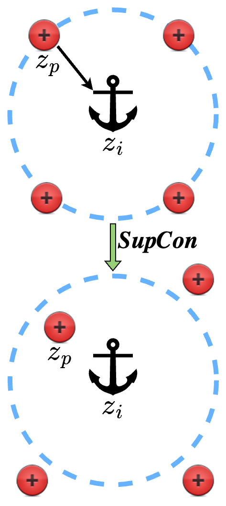
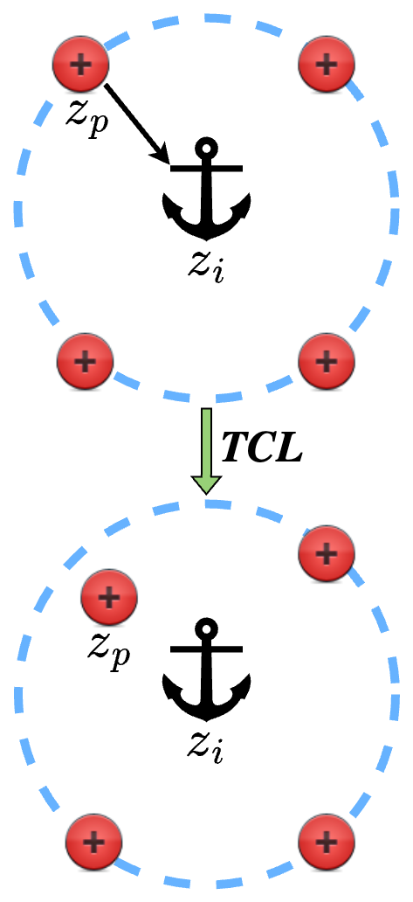

# Tuned Contrastive Learning

[](https://arxiv.org/abs/2305.10675)

This repository is the Official code for our WACV 2025 paper: [Tuned Contrastive Learning](https://arxiv.org/abs/2305.10675).

[//]: # (![intro]&#40;assets/supcon.png&#41;)
<p float="left">
  
   
</p>

### Abstract

In recent times, contrastive learning based loss functions have become increasingly popular for visual self-supervised representation learning owing to their state-of-the-art (SOTA) performance. Most of the modern contrastive learning methods generalize only to one positive and multiple negatives per anchor in a batch. A recent state-of-the-art contrastive loss called supervised contrastive (SupCon) loss, extends self-supervised contrastive learning to supervised setting by generalizing to multiple positives and negatives in a batch and improves upon the cross-entropy loss. In this paper, we propose a novel contrastive loss function — Tuned Contrastive Learning (TCL) loss, that generalizes to multiple positives and negatives in a batch and offers parameters to tune and improve the gradient responses from hard positives and hard negatives. We provide theoretical analysis of our loss function's gradient response and show mathematically how it is better than that of SupCon loss. We empirically compare our loss function with SupCon loss and cross-entropy loss in supervised setting on multiple classification-task datasets to show its effectiveness. We also show the stability of our loss function to a range of hyper-parameter settings. Unlike SupCon loss which is only applied to supervised setting, we show how to extend TCL to self-supervised setting and empirically compare it with various SOTA self-supervised learning methods. Hence, we show that TCL loss achieves performance on par with SOTA methods in both supervised and self-supervised settings.

# How to Run

Specify the loss function ('tcl'/'supcon'), dataset, model, batch size, lr_contrastive and k1, k2 (for TCL) to start the training.

```
python3 train.py --run_type tcl --dataset cifar100 --model resnet50 --batch_size 64 --k1 5000.0 --k2 1.0 --lr_contrastive 0.1
```

# How to use it

## Installation

After creating a virtual environment with your software of choice just run 
```
pip install -r requirements.txt
```

### Citation
If you find this code useful, please consider citing:
```
@misc{animesh2023tunedcontrastivelearning,
      title={Tuned Contrastive Learning}, 
      author={Chaitanya Animesh and Manmohan Chandraker},
      year={2023},
      eprint={2305.10675},
      archivePrefix={arXiv},
      primaryClass={cs.CV},
      url={https://arxiv.org/abs/2305.10675}, 
}
```